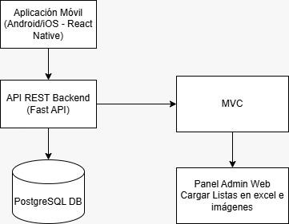

# 📋 Test Plan - Lista de Precios

## 👥 Integrantes
- Enzo Mastrangelo  
- Santiago Navarro  
- Máximo Sat  
- Joaquín Piastrellini  

**Materia:** Aseguramiento de la Calidad de Software

---

## ✅ Document Approval

| Nombre                | Rol         | Fecha       | Aprobación |
|----------------------|-------------|-------------|------------|
| Máximo Rajbal Sat    | QA Lead     | 15/06/2025  | ✔ / ✘      |
| Enzo Mastrangelo      | Dev         | 15/06/2025  | ✔ / ✘      |
| Santiago Navarro     | Dev         | 15/06/2025  | ✔ / ✘      |
| Joaquín Piastrellini | Dev Lead    | 15/06/2025  | ✔ / ✘      |
| John Doe             | Cliente     | 15/06/2025  | ✔ / ✘      |

---

## 1. 📘 Introducción

### 1.1 Propósito
El propósito de este documento es definir el plan de pruebas para el sistema de consulta de precios desarrollado para una distribuidora de artículos de limpieza.

### 1.2 Alcance

**In Scope:**
- Funcionalidad: Validar que la app cargue precios, nombre, código e imagen de cada producto.
- Usabilidad: Pruebas en condiciones reales.
- Compatibilidad: Android y iOS con conexión permanente.
- UI: Claridad visual de la información.

**Out of Scope:**
- Seguridad.
- Performance.
- Hardware.
- Gestión de stock.
- Historial de listas.

### 1.3 Definiciones

| Término    | Definición                                                                 |
|------------|----------------------------------------------------------------------------|
| QA Lead    | Responsable de coordinar las pruebas.                                      |
| Dev Lead   | Responsable técnico del sistema.                                           |
| Dev        | Desarrollador.                                                             |
| Cliente    | Representante del negocio.                                                 |
| Vendedor   | Usuario final que consulta precios.                                        |
| Admin      | Carga listas semanalmente desde casa central.                              |

---

## 2. 📌 Requerimientos

### 2.1 Descripción de Roles

| Rol      | Descripción                                                                 |
|----------|------------------------------------------------------------------------------|
| Vendedor | Consulta precios desde celular (Android/iOS).                               |
| Admin    | Sube listas de precios semanalmente.                                         |
| Cliente  | Patrocinador del proyecto, valida entregables.                              |

### 2.2 Funcionalidades por Rol

**🧍 Vendedor**
- Buscar productos por nombre o código (barras o interno).
- Ver precio actual del producto.
- Visualizar imagen del producto.
- Verificar que la lista sea la más reciente.

**🧑‍💼 Admin**
- Subir listas de precios desde Excel.
- Mantener la versión vigente semanalmente.
- Cargar imágenes de productos.
- Verificar que cada producto tenga nombre, código, precio e imagen.

---

### 2.3 🧠 User Stories

#### 📱 Vendedor

**Historia 1: Buscar producto por nombre o código**  
*Criterios de aceptación:*  
- Buscar por nombre parcial o completo.  
- Aceptar código de barras o interno.  
- Mostrar info completa o mensaje claro si no existe.

**Historia 2: Ver precio actual**  
- Mostrar precio actualizado según última lista.

**Historia 3: Ver imagen del producto**  
- Mostrar imagen si está disponible, o ícono de no disponible.

**Historia 4: Confirmar última versión de la lista**  
- Mostrar fecha de última actualización.

#### 🖥️ Admin

**Historia 5: Subir listas desde Excel**  
- Aceptar solo `.xls` o `.xlsx`.  
- Confirmar carga exitosa o error si está mal.

**Historia 6: Mantener lista vigente semanalmente**  
- Reemplazar lista anterior sin errores.  
- Llevar control de versiones.

**Historia 7: Subir imágenes manualmente**  
- Aceptar `.png`, `.jpg`, `.jpeg`.  
- Asociar correctamente al producto.

**Historia 8: Verificar campos mínimos**  
- Validar nombre, código, precio e imagen.  
- Alertar si falta alguno.

---

### 2.4 🧪 Casos de Prueba

| TC ID  | User Story           | Resumen                       | Pre-requisitos                   | Procedimiento                       | Resultado Esperado                            |
|--------|----------------------|-------------------------------|----------------------------------|-------------------------------------|------------------------------------------------|
| TC-01  | Historia 1           | Buscar por nombre             | App instalada, sesión activa     | Buscar nombre                       | Lista de productos coincidentes               |
| TC-02  | Historia 1           | Buscar por código de barras   | Escáner activo                   | Escanear código válido              | Producto correspondiente                      |
| TC-03  | Historia 2           | Ver precio actualizado        | Producto cargado                 | Buscar por nombre/código            | Precio actualizado visible                    |
| TC-04  | Historia 3           | Ver imagen del producto       | Imagen cargada                   | Buscar producto                     | Imagen visible junto al nombre                |
| TC-05  | Historia 4           | Verificar versión de lista    | Lista cargada                    | Acceder a app                       | Fecha de última carga visible                 |
| TC-06  | Historia 5           | Subir Excel válido            | Archivo .xlsx                    | Subir desde panel admin             | Confirmación de carga exitosa                 |
| TC-07  | Historia 5           | Subir Excel inválido          | Archivo incorrecto (.txt)        | Subir desde panel admin             | Mensaje de error                              |
| TC-08  | Historia 6           | Reemplazar lista anterior     | Lista anterior cargada           | Subir nueva lista                   | Reemplazo sin errores                         |
| TC-09  | Historia 7           | Subir imagen de producto      | Imagen válida                    | Subir desde panel admin             | Imagen asociada correctamente                 |
| TC-10  | Historia 8           | Verificar campos requeridos   | Producto incompleto              | Subir lista                         | Advertencia antes de cargar                   |

## 3. Especificaciones 🧠

### 3.1 - Arquitectura

El sistema se basa en una arquitectura cliente-servidor compuesta por los siguientes elementos:

- **Aplicación móvil (Cliente)**: Usada por los vendedores para consultar precios de productos de forma rápida y visual. Se conecta al backend mediante solicitudes HTTP.
- **Backend (API RESTful)**: Expone los endpoints necesarios para buscar productos, obtener precios, imágenes, y validar la versión de la lista.
- **Base de datos**: Almacena toda la información de productos, listas de precios, imágenes y metadatos de versiones.
- **Interfaz Admin (desde navegador o backend)**: Utilizada por el personal de casa central para cargar semanalmente las listas de Excel e imágenes de productos.

#### Diagrama de arquitectura

### 3.2 - Definición de API

El contrato de la API está definido usando el estándar OpenAPI 3.0.

📄 [Ver contrato OpenAPI (openapi.yaml)](./docs/openapi.yaml)
